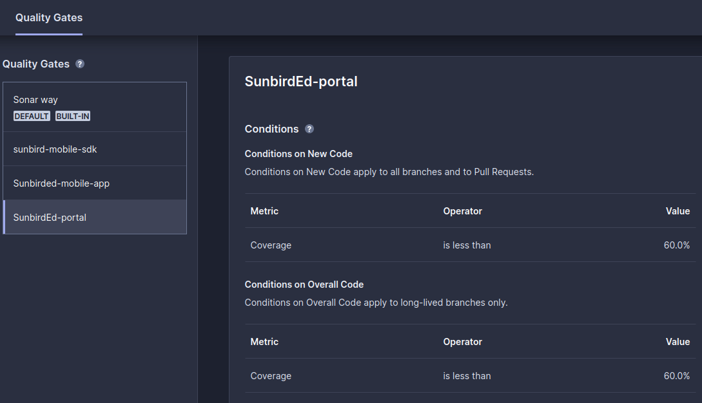

## Milestones
- [x] Understanding project workflow
- [x] Review integrated Sonar scanning functionality
- [x] Exploring Sonar toolset - SonarQube, SonarCloud, SonarLint and Scanner
- [x] Understanding Sonar quality gates

## Screenshots / Videos 

## Contributions

## Learnings

1. SonarQube is a tool for static code analysis. It is used to detect bugs, code smells, and security vulnerabilities in the code.
2. SonarCloud is a cloud-based version of SonarQube. It is used to analyze the code in the cloud.
3. SonarLint is a tool for IDEs that provides on-the-fly feedback to developers on new bugs and quality issues injected into their code.
4. Sonar Scanner is a tool that is used to run SonarQube analysis on any project.
5. Sonar Quality Gates are a set of conditions that are used to determine whether a project is ready for production or not. They are used to define the quality of the code. They act as checkpoints to ensure that your code meets certain quality standards before it can be considered for further development or deployment.
